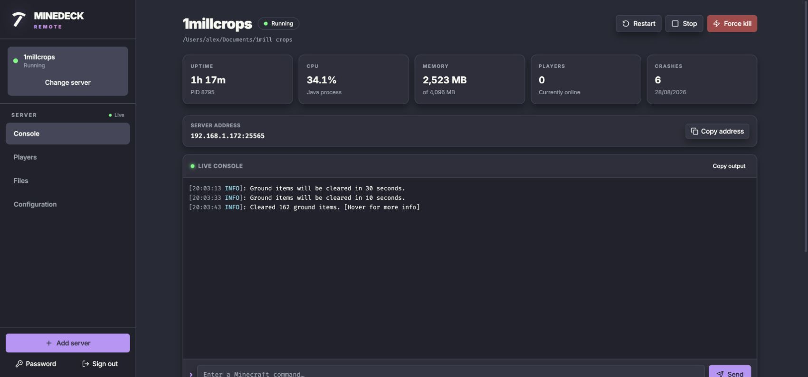
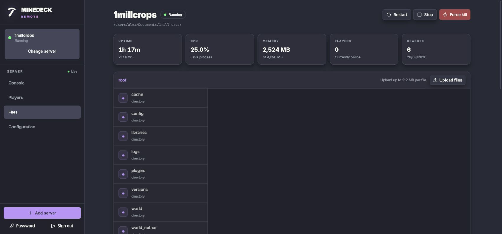

<div align="center">

# ⛏️ MineDeck Remote

**A fast, self-hosted control room for Minecraft servers on your Mac.**

[](https://nodejs.org/)
[](#run-on-macos)
[](https://react.dev/)
[](https://fastify.dev/)

Run, monitor, edit, and recover your servers from any browser on your local network—without Docker, a database, or a heavyweight control panel.


</div>

## Why MineDeck?

| Live control | Files without fear | Made for the LAN |
| --- | --- | --- |
| Real-time console, commands, CPU/RAM charts, players, uptime, and crash history. | Edit configs in-browser, upload large files, and move deletions to Trash instead of destroying them. | Password-protected sessions, optional HTTPS, Bonjour discovery, and a native macOS background service. |

## See it in action

| Live console and server metrics | Full server file manager |
| --- | --- |
|  |  |

> Seven bundled dark themes, one focused dashboard, and no infrastructure tax.

## What it does

- Starts, gracefully stops, restarts, and force-kills multiple Java servers
- Streams console output over WebSockets and sends console commands
- Shows status, uptime, Java CPU/RAM, online players, and crash history
- Optionally restarts a server five seconds after an unexpected exit
- Edits server launch settings, memory limits, Java arguments, and stop timeout
- Downloads stable Paper server JARs directly from PaperMC and verifies their SHA-256 checksums
- Browses files, uploads binary files, and syntax-highlights editable text/config files inside each server folder
- Moves deleted files and folders to the host machine's Trash or Recycle Bin so they remain recoverable
- Includes seven dark dashboard themes with a persistent selector in the footer
- Protects the dashboard with scrypt-hashed passwords, rate-limited login, HttpOnly sessions, origin checks, and optional HTTPS

No Docker, virtual machine, Redis, MariaDB, or external control panel is involved. Configuration is stored atomically in `data/minedeck.json`.

## Run on macOS

Requirements: Node.js 22.12 or newer, plus the Java version required by your Minecraft server.

```bash
git clone <this-repository>
cd MineDeckRemote
npm install
npm run build
MINEDECK_PASSWORD='use-a-long-unique-password' npm start
```

Open [http://localhost:8787](http://localhost:8787). `MINEDECK_PASSWORD` is only used to create the first password hash. If it is omitted on first launch, MineDeck prints a random password once in the terminal.

For later starts, use:

```bash
npm start
```

While MineDeck is running, type `r` and press Enter in the same terminal to rebuild and restart the host. You do not need to close the terminal or rerun `npm start`. MineDeck finishes a successful build before taking the current host offline; as with any host shutdown, a restart safely stops managed Minecraft servers.

MineDeck binds to `0.0.0.0` by default and prints the LAN URL at startup. On another PC on the same network, open `http://<your-mac-ip>:8787`. If macOS asks, allow incoming connections for Node. Do not port-forward MineDeck directly to the public internet.

## Run continuously in the background

Install MineDeck as a macOS background service after completing the first launch and signing in:

```bash
npm run service:install
```

The native LaunchAgent starts MineDeck whenever you log in, restarts it after an unexpected exit, and keeps the Mac awake from idle sleep while it is connected to power. It also advertises `minedeck.local` with Bonjour, so devices on the same local network can open [http://minedeck.local:8787](http://minedeck.local:8787). It does not require an open Terminal window. Closing a MacBook lid, losing power, logging out, or manually sleeping the Mac can still make the dashboard unavailable.

Use these commands to manage it:

```bash
npm run service:status
npm run service:restart
npm run service:uninstall
```

`service:restart` builds the current source before restarting. Restarting or uninstalling the service gracefully stops any running Minecraft servers. Standard output and errors are saved to `data/minedeck.stdout.log` and `data/minedeck.stderr.log`. Uninstalling moves the LaunchAgent to Trash and leaves MineDeck, its configuration, logs, and server folders untouched.

## Add a Minecraft server

Choose **Download Paper** to create a server folder without downloading a JAR manually. Select a Minecraft version and stable Paper build; MineDeck downloads it from PaperMC, verifies its advertised size and SHA-256 checksum, and registers it as the server JAR. Existing files are never overwritten. Paper is the only downloadable server type currently supported.

You can also prepare the server normally first: place its JAR in its own folder and accept Mojang's EULA in `eula.txt`. In MineDeck, add:

- an easy-to-recognize name;
- the absolute server folder, such as `/Users/alex/minecraft/survival`;
- a JAR path relative to that folder, usually `server.jar`;
- the Java command (`java` uses the system installation) and memory limits.

**Import existing** reads launch settings from `start.sh` or `start.bat` when present, including memory and JVM flags generated by [flags.sh](https://flags.sh). If there is no launch script, it selects `server.jar` (or the only top-level JAR) and uses `java`, 1 GB minimum RAM, and 2 GB maximum RAM as editable defaults. Use **Manual setup** when a folder contains multiple JARs and none is named `server.jar`.

Java arguments are entered one per line. MineDeck always enables Java headless mode and adds `-jar <jar> nogui`, which keeps the server process out of the macOS Dock. Launch settings cannot be changed while a server is running. Removing a running server gracefully stops it first and leaves its entire server folder untouched. The same server cannot be started twice.

The RAM allocation slider adjusts maximum heap in 256 MB steps and keeps minimum RAM within that limit. The numeric fields remain available for exact values and allocations above the slider's initial 24 GB range.

With **Manual setup**, MineDeck creates the server directory (including missing parent folders) when necessary. The server can be added before its configured JAR exists, allowing the JAR to be uploaded afterward from the Files tab; it cannot be started until that JAR is present. **Import existing** continues to require an existing directory and server JAR.

The file browser is confined to that server folder, including through symbolic links. It syntax-highlights YAML, JSON, properties, TOML, XML, and shell files and edits text files up to 2 MB. Editor shortcuts follow the browser platform: Windows and Linux use `Ctrl` while macOS uses `⌘`. Uploads support up to 20 files at a time and 512 MB per file. Uploaded files never overwrite an existing name. Deleting a file or folder sends it to the Trash or Recycle Bin of the machine running MineDeck; the API does not permanently unlink it, and it will never recycle the configured server root folder.

## HTTPS and settings

Plain HTTP is usually adequate only on a trusted home LAN. For encrypted login and WebSockets, provide a certificate and key:

```bash
MINEDECK_TLS_CERT=/absolute/path/to/cert.pem \
MINEDECK_TLS_KEY=/absolute/path/to/key.pem \
npm start
```

Other settings:

| Variable | Default | Purpose |
| --- | --- | --- |
| `MINEDECK_HOST` | `0.0.0.0` | Listening interface |
| `MINEDECK_PORT` | `8787` | Dashboard port |
| `MINEDECK_DATA` | `data/minedeck.json` | JSON data file |
| `MINEDECK_MDNS_HOST` | disabled (`minedeck.local` for the background service) | Bonjour hostname advertised on the local network |

Stopping MineDeck gracefully stops its managed servers before exiting. Login sessions are intentionally memory-only, so an app restart signs browsers out.

## Development

```bash
npm run dev
npm test
npm run build
```

The Vite dashboard runs on port 5173 in development and proxies the API/WebSocket connection to Fastify on port 8787.
